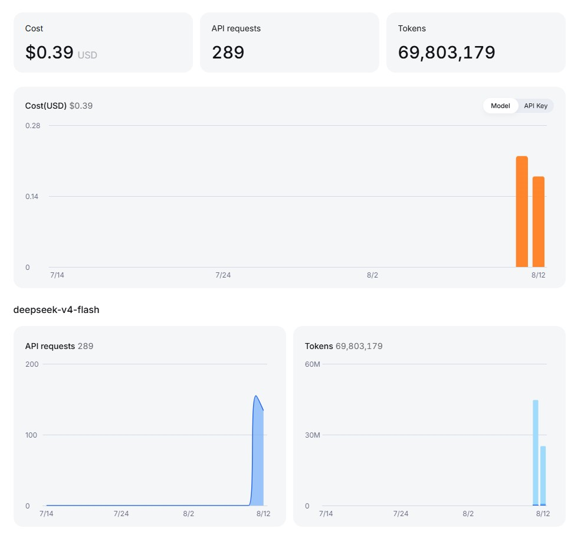

# WindStrap

**Bootstrap 5.3.8 → Tailwind CSS**, translated 1:1 by composing Tailwind utilities with the **`@apply`** directive.

WindStrap is a drop-in stylesheet that gives you Bootstrap's exact class names (`.btn-primary`, `.col-md-6`, `.d-flex`, `.text-bg-success`, …) built on top of Tailwind's utility engine — so you get Bootstrap's API with Tailwind's pipeline (JIT output, PurgeCSS-style tree-shaking, familiar utility syntax for custom tweaks).

**Live docs:** [https://rip747.github.io/windstrap/](https://rip747.github.io/windstrap/)

## Versioning

WindStrap mirrors Bootstrap's version and appends its own patch as a semver
prerelease suffix. For example, **`5.3.8-1`** tracks **Bootstrap 5.3.8** with
**WindStrap patch 1**. WindStrap patches fix WindStrap-specific issues (a CSS
translation bug, build/publishing problem, etc.) without changing the
Bootstrap classes it targets.

WindStrap prereleases are published under the `latest` npm dist-tag, so a plain
`npm install @rip747/windstrap` (or the CDN links below) gets the newest one.
Because they're prereleases, semver ranges like `^5.3.8` will not match them —
pin the exact version if you use a range.

## Quick start

Install from npm:

```bash
npm install @rip747/windstrap
```

Or link the compiled stylesheet straight from a CDN (jsDelivr mirrors npm automatically):

```html
<!-- Minified -->
<link rel="stylesheet" href="https://cdn.jsdelivr.net/npm/@rip747/windstrap@5.3.8-1/dist/windstrap.min.css">

<!-- Unminified -->
<link rel="stylesheet" href="https://cdn.jsdelivr.net/npm/@rip747/windstrap@5.3.8-1/dist/windstrap.css">
```

unpkg serves the same files:

```html
<link rel="stylesheet" href="https://unpkg.com/@rip747/windstrap@5.3.8-1/dist/windstrap.min.css">
```

## How it works

Every Bootstrap class is re-declared as plain CSS that pulls in Tailwind utilities via `@apply`:

```css
/* src/sections/buttons.css */
.btn-primary {
  @apply bg-primary text-white border-primary
    hover:bg-[#0b5ed7] hover:border-[#0a58ca]
    active:bg-[#0a58ca] active:border-[#0a53be]
    active:shadow-[inset_0_3px_5px_rgba(0,0,0,0.125)];
  --bs-btn-focus-shadow-rgb: 49, 132, 253;
}
```

```css
/* src/generated/grid.css  (machine-generated, but real @apply CSS) */
.col-sm-6 { @apply sm:w-1/2; }          /* → @media (min-width: 576px) { width: 50% } */
.mt-sm-3 { @apply sm:mt-[1rem] !important; }
.d-md-none { @apply md:hidden !important; }
```

To make the responsive variants line up **exactly** with Bootstrap, the Tailwind theme's `screens` are set to Bootstrap's breakpoints:

| Name | Bootstrap | Tailwind `screens` |
|------|-----------|--------------------|
| `sm` | 576px | 576px |
| `md` | 768px | 768px |
| `lg` | 992px | 992px |
| `xl` | 1200px | 1200px |
| `xxl` | 1400px | 1400px |

Bootstrap's full CSS custom-property design tokens (`--bs-primary`, `--bs-body-bg`, …) are preserved in `src/sections/root.css`, including the `[data-bs-theme="dark"]` overrides, so Bootstrap's theming and dark mode keep working.

## What's translated

- **Layout** — containers, `.row`, `.col-*`, `.col-sm…xxl-*`, `.row-cols-*`, `.offset-*`, gutters (`.g-*`, `.gx-*`, `.gy-*`) across all 6 breakpoints
- **Content** — headings, `.display-*`, `.lead`, lists, blockquotes, images, figures, tables (incl. striped/hover/bordered/thematic variants + responsive wrappers)
- **Forms** — `.form-control` (± sm/lg/plaintext/color), `.form-select`, checks/radios/switches, `.form-range`, `.form-floating`, `.input-group`, validation states
- **Components** — buttons (all solid/outline/link variants, sizes, groups), dropdowns, nav & navbar (incl. `.navbar-expand-*`), cards, accordion, breadcrumb, pagination, badges, alerts, progress, list-groups (incl. thematic + horizontal), close buttons, toasts
- **Overlays** — modal (incl. fullscreen variants), tooltips, popovers, carousel, spinners, offcanvas, placeholders
- **Helpers** — `.text-bg-*`, `.link-*` helpers, focus rings, icon links, ratios, fixed/sticky positioning, h/v-stack, `.visually-hidden`, `.stretched-link`, `.text-truncate`, `.vr`
- **Utilities** — alignment, float, object-fit, opacity, overflow, display, shadows, position/translate, borders, sizing, flexbox (all justify/align/order utilities), spacing (`m/p/g` incl. `auto`), typography (`.fs-*`, `.fw-*`, `.lh-*`, text transform/decoration), text/background colors incl. subtle & emphasis variants and `*-opacity` modifiers, user-select, rounded corners (all sides/sizes), visibility, z-index
- **Responsive variants** — every utility family at `sm`/`md`/`lg`/`xl`/`xxl`, plus `.d-print-*`

A few classes (e.g. `.border`, `.m-0`, `.w-auto`, `.overflow-hidden`, `.shadow`, `.opacity-25`, `.rounded`, `.visible`) would create a circular dependency if the class name matched the applied utility name, so they are written as the equivalent raw declaration — their values are byte-for-byte Bootstrap's.

## Project layout

```
WindStrap/
├─ .github/workflows/pages.yml  # GitHub Pages build + deploy
├─ tailwind.config.js        # Bootstrap screens + palette, fonts
├─ postcss.config.js
├─ scripts/
│  ├─ generate-utilities.js  # generates the repetitive grid/utility/responsive CSS
│  └─ fetch-docs.js          # downloads Bootstrap's docs, swaps in WindStrap CSS
├─ src/
│  ├─ windstrap.css          # entry point (imports Tailwind + sections)
│  └─ sections/              # hand-authored @apply translations
│     ├─ root.css            # design tokens + reboot
│     ├─ layout.css          # containers, row base
│     ├─ content.css         # typography, images, tables
│     ├─ forms.css
│     ├─ buttons.css
│     ├─ nav.css
│     ├─ components.css
│     ├─ overlays.css
│     └─ helpers.css
│  └─ generated/             # produced by scripts/generate-utilities.js
│     ├─ grid.css
│     ├─ utilities.css
│     └─ responsive.css
├─ docs/                     # fetched Bootstrap 5.3.8 docs, styled by WindStrap (86 pages)
│  ├─ index.html             # generated section overview
│  ├─ js/bootstrap.bundle.min.js  # vendored Bootstrap JS (offline demos, no SRI/CORS)
│  └─ <section>/*.html       # one folder per section, rendered with dist/windstrap.min.css
├─ index.html                # redirects to docs/index.html
├─ demo.html                 # demo of the translated classes
└─ dist/
   ├─ windstrap.css          # compiled output
   └─ windstrap.min.css      # minified build (used by docs + CDN)
```

## Build

```bash
npm install
npm run build      # regenerate + compile  →  dist/windstrap.css + windstrap.min.css
npm run docs       # fetch Bootstrap 5.3.8 docs, swap in WindStrap CSS  →  docs/
npm run build:all  # both
npm run watch      # rebuild CSS on change
```

`npm run docs` downloads the official Bootstrap 5.3.8 documentation pages and
replaces Bootstrap's stylesheet with `dist/windstrap.min.css`. The result is a
live drop-in compatibility test: if the pages under `docs/` render exactly like
the originals on getbootstrap.com, WindStrap is a proven drop-in replacement.

Use it by linking the compiled file:

```html
<link rel="stylesheet" href="dist/windstrap.css">
```

## Docker (no Node/npm on your machine)

The project ships with a `Dockerfile` + `compose.yaml` so you can build it
entirely inside a container — no need to install Node.js or npm locally.

```bash
# one-time image build (installs node_modules inside the container)
docker compose build

# run the npm scripts through Docker
docker compose run --rm build      # -> dist/windstrap.css
docker compose run --rm docs       # -> docs/ pages
docker compose run --rm build-all  # both
docker compose up watch            # watch mode (foreground; Ctrl+C to stop)
```

On Windows/PowerShell you can use the convenience wrapper (same commands):

```powershell
.\windstrap.ps1            # build:all
.\windstrap.ps1 docs       # -> docs/ pages
.\windstrap.ps1 watch
.\windstrap.ps1 shell      # open a shell inside the container
```

How it works: your project folder is bind-mounted at `/app`, and
`node_modules` lives in a named Docker volume — so generated files
(`dist/`, `docs/`) appear on your disk while the container keeps its own
Linux-installed dependencies. The image is `node:20-alpine` (Node 20, matching
the project's tooling).

## Git co-authoring

This repo ships with a `prepare-commit-msg` hook (in `githooks/`) that appends
`Co-authored-by: DeepSeek V4 Flash <service@deepseek.com>` to every
commit, so the coding model (DeepSeek V4 Flash) is credited as a co-author. It
works from any git client — including the VS Code Source Control panel — with
nothing extra to type.

Enable it on a fresh clone:

```bash
git config core.hooksPath githooks
```

Change the credited identity by editing the `COAUTHOR=` line in
`githooks/prepare-commit-msg`. On macOS/Linux, also make it executable:
`chmod +x githooks/prepare-commit-msg`.

## Publish to GitHub Pages

The repo ships with a GitHub Actions workflow (`.github/workflows/pages.yml`)
that builds the CSS + docs (`npm run build:all`, i.e. `scripts/fetch-docs.js`)
and publishes them to GitHub Pages on every push to `main`.

1. Push the repo to GitHub.
2. In the repo go to **Settings → Pages → Source** and choose
   **“GitHub Actions”** (do **not** pick “Deploy from a branch” — the
   workflow handles the build and deploy itself).
3. The first deploy publishes the site to
   [https://rip747.github.io/windstrap/](https://rip747.github.io/windstrap/).

How it's served: the workflow stages `index.html`, `demo.html`, `dist/` and
`docs/` into the Pages root, mirroring the repo layout. `index.html` redirects
straight to `docs/index.html`, and because `dist/` is included at the root,
all the docs pages keep their styling (their `../../dist/windstrap.css`
relative paths resolve correctly).

Open `docs/index.html` in a browser to browse the translated docs — all of
**Customize** (8), **Layout** (8), **Content** (5), **Forms** (9),
**Components** (24), **Helpers** (12) and **Utilities** (20) are translated
(86 pages, `docs/<section>/<page>.html`). Getting Started, Extend and About are
intentionally not translated.

> The bundled `dist/windstrap.css` is the full translation. Because every class is defined via `@apply`, Tailwind only emits rules that are actually used — if you want a trimmed build, add your own HTML/JS files to `content` in `tailwind.config.js` (keep the `.css` files out of `content`, see the note there).

## Notes & caveats

- Tailwind `screens` are redefined to Bootstrap's breakpoints — this is intentional and scoped to this stylesheet.
- Component color systems (buttons, alerts, list-groups, `text-bg-*`, links) intentionally reuse Bootstrap's RGB/token CSS variables so `--bs-*-opacity` modifiers and `[data-bs-theme]` dark mode keep working.
- Pseudo-elements, keyframes, and child-targeting selectors (e.g. `.row-cols-2 > *`) are written as plain CSS — `@apply` cannot express those.
- The `docs/` site is Bootstrap's official docs layout, fetched by `scripts/fetch-docs.js` and styled with WindStrap instead of Bootstrap's CSS — a live drop-in compatibility test. Only the framework CSS is WindStrap's; a locally-vendored copy of Bootstrap's JS bundle (`docs/js/bootstrap.bundle.min.js`) powers the interactive demos (dropdowns, modals, offcanvas, carousel…) from `file://` with no SRI/CORS or network issues. Bootstrap's Astro module scripts (DocSearch, clipboard, DocsScripts), the GitHub/StackBlitz buttons, ads, and analytics are all stripped.

## Built with AI

This project was built with assistance from AI, using **DeepSeek V4 Flash** as the coding model. Current cost of the project is $0.39.



## License

MIT
